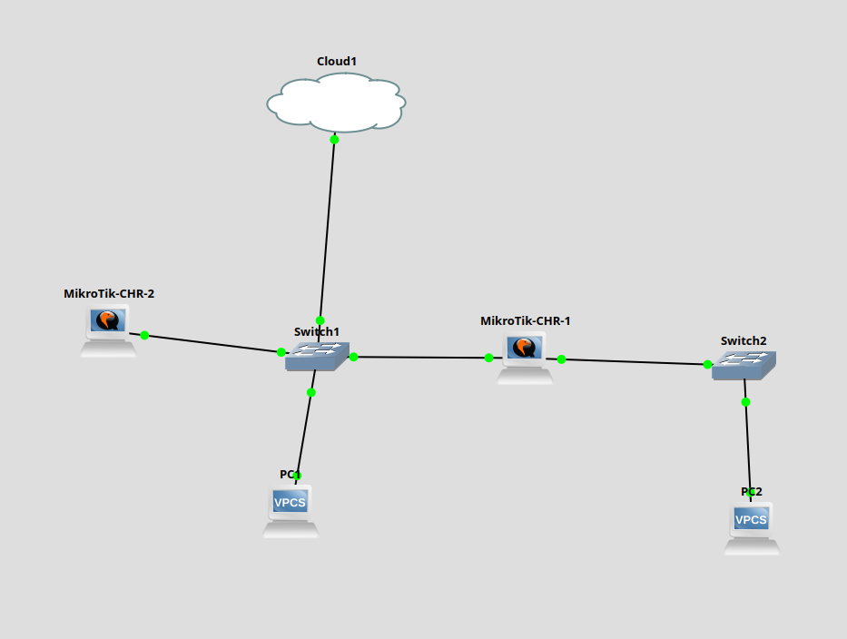

# Lab Réseau Avancé — GNS3 + OPNSense + MikroTik CHR

> Simulation d'une infrastructure réseau d'entreprise complète sous GNS3, avec déploiement d'OPNSense comme firewall périmétrique (WAN/LAN/DMZ, filtrage, NAT) et routage dynamique OSPF via MikroTik Cloud Hosted Router.

**Auteur :** Guillaume Brunel — MSc Cloud, EPITECH Lyon  
**Environnement :** Ubuntu 24 | GNS3 2.2.57 | OPNSense 26.1 | MikroTik CHR 7.22.1

---

## Objectif

Ce projet simule une architecture réseau typique PME/ETI :

- Firewall périmétrique avec segmentation WAN / LAN / DMZ
- Routage dynamique OSPF single-area (Area 0)
- Routeurs MikroTik CHR interconnectés via GNS3
- Interconnexion GNS3 ↔ VirtualBox via interface Host-only

---

## Architecture

```
[Internet simulé]
        |
   [Cloud GNS3] ←→ vboxnet0 ←→ [OPNSense 26.1]
                                  |        |         |
                                 WAN      LAN       DMZ
                                (em1)   (em0)      (em2)
                                      192.168.56.2  192.168.100.1
                                          |
                              ┌───────────┴────────────┐
                              |                        |
                    [MikroTik-CHR-2]          [MikroTik-CHR-1]
                    192.168.56.10             192.168.56.12
                              |               192.168.2.1
                           Switch1               |
                              |               Switch2
                             PC1                 |
                                               PC2
```

### Topologie GNS3



---

## Stack technique

| Composant | Rôle | Version |
|---|---|---|
| GNS3 | Émulateur réseau | 2.2.57 |
| OPNSense | Firewall périmétrique | 26.1 (FreeBSD 14.3) |
| MikroTik CHR | Routeurs logiciels (OSPF) | 7.22.1 |
| VirtualBox | Virtualisation OPNSense | — |
| Ubuntu | Hôte | 24 |

---

## OPNSense — Configuration

### Dashboard


OPNSense 26.1 tourne sur FreeBSD 14.3 avec OpenSSL 3.0.18. Le dashboard affiche en temps réel les statistiques de trafic par interface (LAN/WAN/DMZ) et l'état des services.

---

### Interfaces

#### WAN (em1)


Interface externe — connectée à l'internet simulé.

#### LAN (em0)


IP statique : **192.168.56.2/24** — réseau interne, connecté à GNS3 via vboxnet0.

#### DMZ (em2)


IP statique : **192.168.100.1/24** — zone démilitarisée pour les serveurs exposés. Pas de DHCP (IPs fixes obligatoires en DMZ).

---

## Firewall — Règles de filtrage

### Philosophie appliquée

OPNSense applique une politique **Default Deny** : tout ce qui n'est pas explicitement autorisé est bloqué.

### Règles WAN → DMZ

#### Allow HTTP to DMZ


Autorise le trafic TCP port 80 depuis n'importe quelle source WAN vers la DMZ.

#### Allow HTTPS to DMZ


Autorise le trafic TCP port 443 depuis n'importe quelle source WAN vers la DMZ.

### Règle DMZ → LAN (critique)


**Block** tout trafic de la DMZ vers le LAN.

> **Pourquoi c'est la règle la plus importante ?** Si un serveur en DMZ est compromis, cette règle empêche l'attaquant de rebondir vers le réseau interne. C'est le principe fondamental de la DMZ.

### Règles LAN


Le LAN est autorisé à accéder à toutes les destinations (trafic sortant).

---

## Routage dynamique OSPF

### Stack utilisée

OPNSense intègre FRRouting via le plugin `os-frr`. Les routeurs MikroTik CHR font tourner OSPF nativement. Ensemble ils forment un réseau OSPF **single-area (Area 0)** sans aucune route statique.

### Configuration OPNSense

- Plugin `os-frr` installé via System → Firmware → Plugins
- Area 0.0.0.0 (backbone)
- Réseaux annoncés : 192.168.56.0/24 (LAN) et 192.168.100.0/24 (DMZ)
- Interfaces OSPF : LAN (em0) et DMZ (em2) — WAN exclu volontairement

### Configuration MikroTik CHR

```
# Instance OSPF (router-id unique par routeur)
routing ospf instance add name=default router-id=1.1.1.1

# Area backbone
routing ospf area add name=backbone area-id=0.0.0.0 instance=default

# Interfaces participantes
routing ospf interface-template add area=backbone interfaces=ether1
routing ospf interface-template add area=backbone interfaces=ether2
```

### Voisins OSPF — OPNSense


OPNSense voit deux voisins en état **Full** :
- **2.2.2.2** (MikroTik-CHR-2) → Full/Backup
- **1.1.1.1** (MikroTik-CHR-1) → Full/DROther

### Table de routage OSPF — OPNSense


OPNSense voit 3 réseaux en Area 0 — dont **192.168.2.0/24 appris automatiquement via CHR-1** ✅

### Voisins OSPF — MikroTik-CHR-1


CHR-1 voit OPNSense (192.168.56.2) et CHR-2 (192.168.56.10) en état **Full**.

### Table de routage — MikroTik-CHR-1


La route `192.168.100.0/24` (DMZ OPNSense) est apprise automatiquement via OSPF avec une distance administrative de 110 — **aucune route statique configurée**.

---

## Interconnexion GNS3 ↔ OPNSense

La topologie GNS3 est connectée à OPNSense via un nœud **Cloud** configuré sur l'interface `vboxnet0` (Host-only VirtualBox).


Ping depuis un routeur GNS3 vers OPNSense LAN (192.168.56.2) — **0% packet loss**.

---

## Adressage IP

| Équipement | Interface | IP | Rôle |
|---|---|---|---|
| OPNSense | em0 (LAN) | 192.168.56.2/24 | Passerelle LAN |
| OPNSense | em2 (DMZ) | 192.168.100.1/24 | Passerelle DMZ |
| MikroTik-CHR-2 | ether1 | 192.168.56.10/24 | Routeur LAN |
| MikroTik-CHR-1 | ether1 | 192.168.56.12/24 | Routeur core |
| MikroTik-CHR-1 | ether2 | 192.168.2.1/24 | Accès Switch2/PC2 |

---

## Roadmap — Évolutions prévues

- [ ] **VPN WireGuard** — configurer un tunnel site-à-site sur OPNSense pour simuler l'accès distant
- [ ] **Routage multi-liens** — simuler deux liens WAN avec basculement automatique
- [ ] **Supervision** — intégrer Zabbix ou Prometheus pour monitorer les équipements
- [ ] **Serveur DMZ** — déployer un serveur web Nginx dans la DMZ et valider les règles HTTP/HTTPS

---

## Compétences démontrées

- Déploiement et configuration d'un firewall next-gen OPNSense (WAN/LAN/DMZ)
- Segmentation réseau et règles de filtrage explicites (Default Deny)
- Routage dynamique OSPF single-area avec MikroTik CHR et OPNSense FRR
- Construction d'une topologie réseau multi-équipements sous GNS3
- Interconnexion GNS3 ↔ VirtualBox via interface Host-only
- Documentation technique d'architecture réseau

---

## Liens utiles

- [Documentation OPNSense](https://docs.opnsense.org)
- [GNS3 Academy](https://academy.gns3.com)
- [MikroTik CHR Documentation](https://help.mikrotik.com/docs/display/ROS/Cloud+Hosted+Router)
- [FRRouting Documentation](https://frrouting.org)
