# Lab Réseau Avancé — GNS3 + OPNSense

> Simulation d'une infrastructure réseau d'entreprise complète sous GNS3, avec déploiement d'OPNSense comme firewall périmétrique (WAN/LAN/DMZ, filtrage, NAT) et interconnexion via Cloud GNS3.

**Auteur :** Guillaume Brunel — MSc Cloud, EPITECH Lyon  
**Environnement :** Ubuntu 24 | GNS3 2.2.57 | OPNSense 26.1 | FRRouting (Docker)

---

## Objectif

Ce projet simule une architecture réseau typique PME/ETI :

- Segmentation en zones (WAN / LAN / DMZ)
- Firewall périmétrique avec règles de filtrage explicites
- Routeurs logiciels interconnectés via GNS3
- Interconnexion GNS3 ↔ VirtualBox via interface Host-only

---

## Architecture

```
[Internet simulé]
        |
   [Cloud GNS3] ←→ vboxnet0 ←→ [OPNSense 26.1]
                                  |        |       |
                                 WAN      LAN     DMZ
                                (em1)   (em0)   (em2)
                                        192.168.56.2  192.168.100.1
                                          |
                                    [frrouting-frr-1]
                                    192.168.56.10
                                          |
                                       Switch1
                                       /     \
                                    PC1   [frrouting-frr-2]
                                               |
                                            Switch2
                                               |
                                              PC2
```

### Topologie GNS3

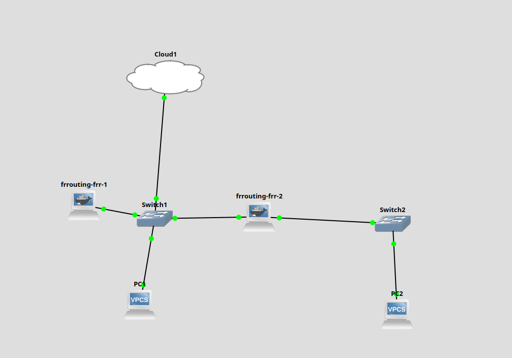

---

## Stack technique

| Composant | Rôle | Version |
|---|---|---|
| GNS3 | Émulateur réseau | 2.2.57 |
| OPNSense | Firewall périmétrique | 26.1 (FreeBSD 14.3) |
| FRRouting | Routeurs logiciels | 8.4 (Docker) |
| VirtualBox | Virtualisation OPNSense | — |
| Ubuntu | Hôte | 24 |

---

## OPNSense — Configuration

### Dashboard

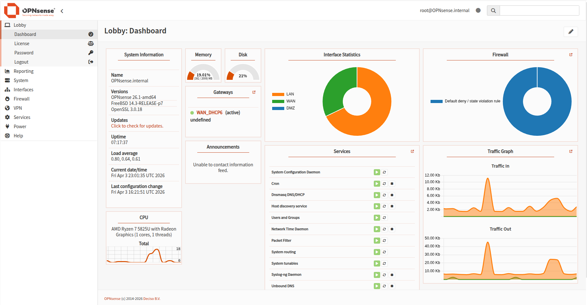

OPNSense 26.1 tourne sur FreeBSD 14.3 avec OpenSSL 3.0.18. Le dashboard affiche en temps réel les statistiques de trafic par interface (LAN/WAN/DMZ) et l'état des services.

---

### Interfaces

#### WAN (em1)

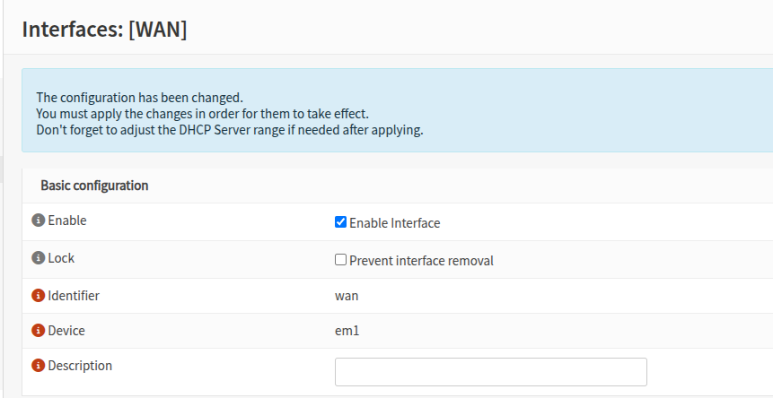

Interface externe — connectée à l'internet simulé. Pas d'IP statique configurée (DHCP simulé).

#### LAN (em0)

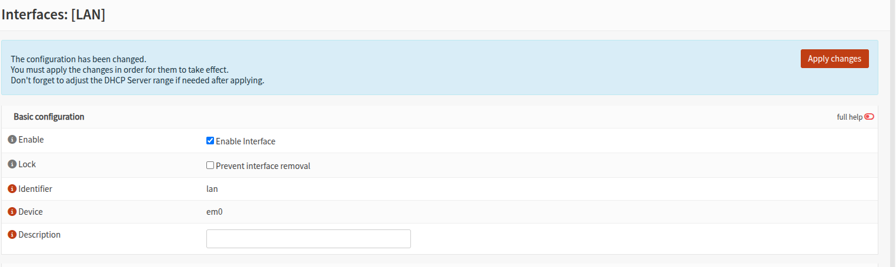

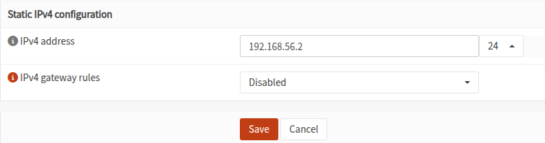

IP statique : **192.168.56.2/24** — réseau interne, connecté à GNS3 via vboxnet0.

#### DMZ (em2 / OPT1)

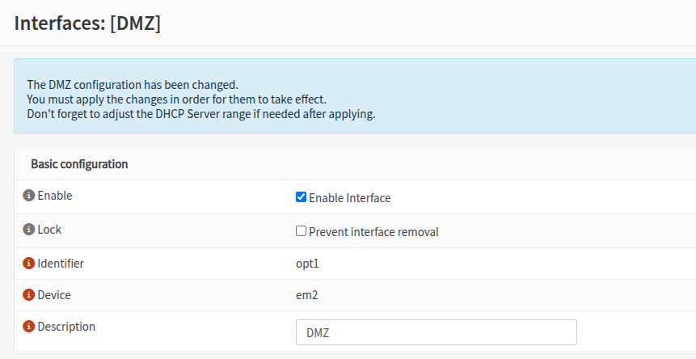

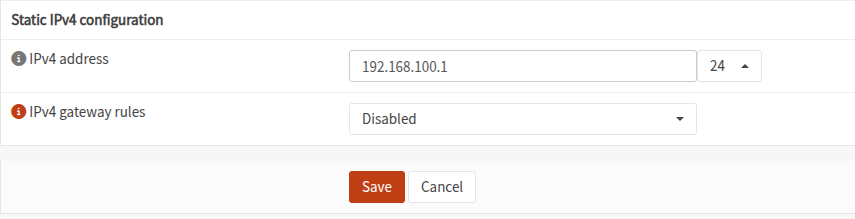

IP statique : **192.168.100.1/24** — zone démilitarisée pour les serveurs exposés. Pas de DHCP (IPs fixes obligatoires en DMZ).

---

## Firewall — Règles de filtrage

### Philosophie appliquée

OPNSense applique une politique **Default Deny** : tout ce qui n'est pas explicitement autorisé est bloqué.

### Règles WAN → DMZ

#### Allow HTTP to DMZ

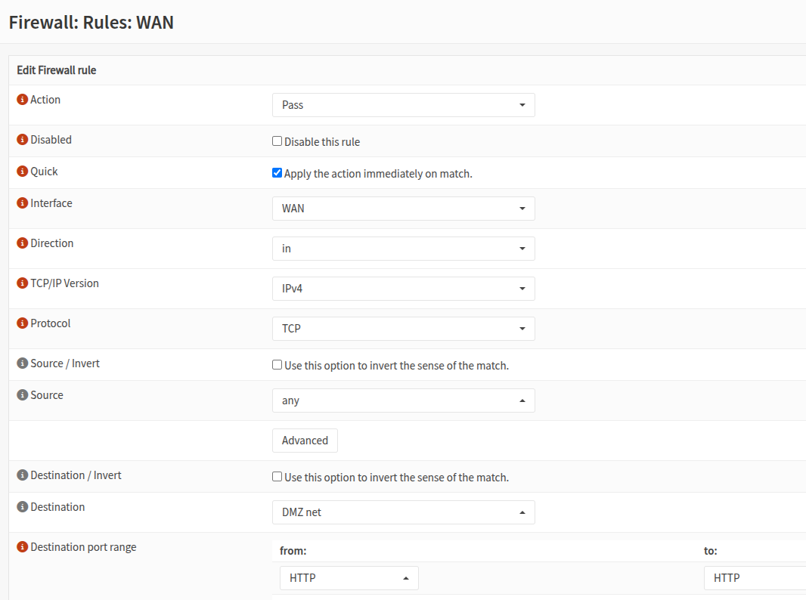

Autorise le trafic TCP port 80 depuis n'importe quelle source WAN vers la DMZ.

#### Allow HTTPS to DMZ

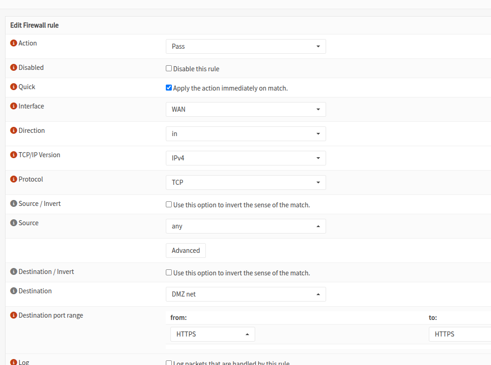

Autorise le trafic TCP port 443 depuis n'importe quelle source WAN vers la DMZ.

### Règle DMZ → LAN (critique)

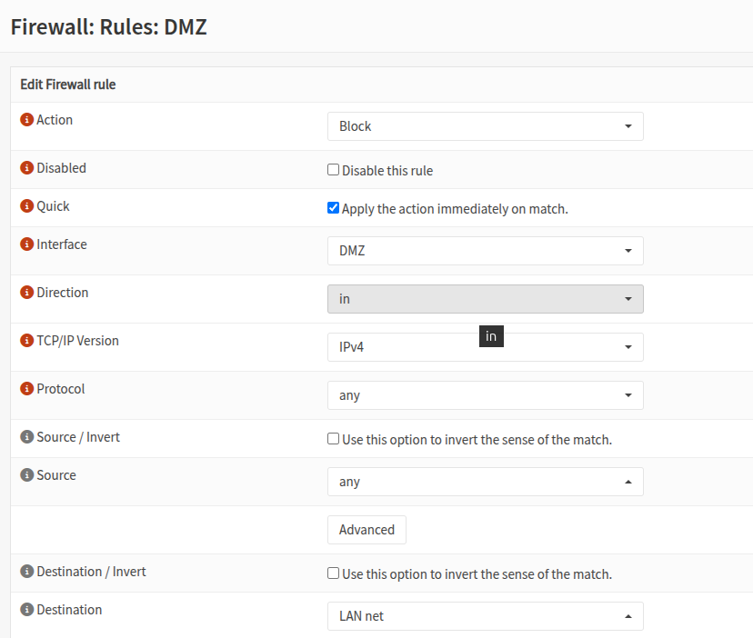

**Block** tout trafic de la DMZ vers le LAN.

> **Pourquoi c'est la règle la plus importante ?** Si un serveur en DMZ est compromis, cette règle empêche l'attaquant de rebondir vers le réseau interne. C'est le principe fondamental de la DMZ.

### Règles LAN

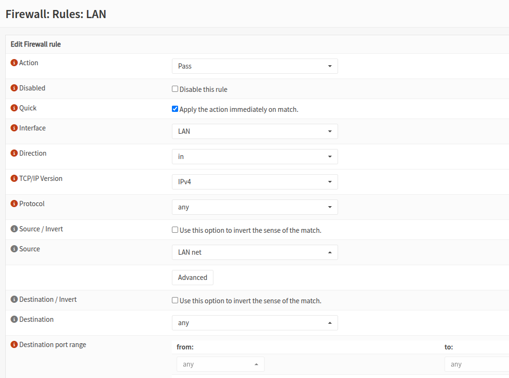

Le LAN est autorisé à accéder à toutes les destinations (trafic sortant).

---

## Interconnexion GNS3 ↔ OPNSense

La topologie GNS3 est connectée à OPNSense via un nœud **Cloud** configuré sur l'interface `vboxnet0` (Host-only VirtualBox).

### Validation — Ping frr-1 → OPNSense

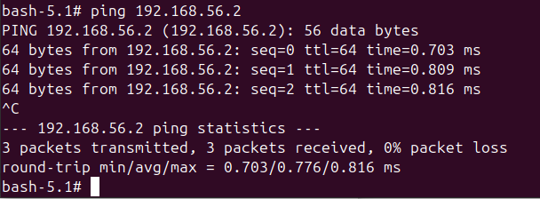

`frrouting-frr-1` (192.168.56.10) ping OPNSense LAN (192.168.56.2) avec succès — **0% packet loss**.

Cela valide que :
- Le Cloud GNS3 est correctement configuré sur vboxnet0
- OPNSense répond depuis VirtualBox
- Les deux environnements de virtualisation sont interconnectés

---

## Routage dynamique OSPF (FRR)

OPNSense intègre FRRouting via le plugin `os-frr` — ce qui permet de configurer OSPF directement depuis l'interface web sans toucher à la ligne de commande.

### Configuration appliquée

- **Plugin** : os-frr installé via System → Firmware → Plugins
- **Area** : 0.0.0.0 (backbone single-area)
- **Réseaux annoncés** : 192.168.56.0/24 (LAN) et 192.168.100.0/24 (DMZ)
- **Interfaces OSPF** : LAN (em0) et DMZ (em2) — WAN exclu volontairement

### Table de routage OSPF — OPNSense


OPNSense voit 3 réseaux en Area 0 — 192.168.56.0/24 (LAN), 192.168.100.0/24 (DMZ), et **192.168.2.0/24 appris automatiquement via CHR-1** ✅

### Voisins OSPF — OPNSense


OPNSense voit deux voisins en état **Full** : 2.2.2.2 (MikroTik-CHR-2) et 1.1.1.1 (MikroTik-CHR-1).

### Voisins OSPF — MikroTik-CHR-1


CHR-1 voit OPNSense (192.168.56.2) et CHR-2 (192.168.56.10) en état **Full**.

### Table de routage — MikroTik-CHR-1


La route `192.168.100.0/24` (DMZ OPNSense) est apprise automatiquement via OSPF avec une distance administrative de 110 — aucune route statique configurée.

> **Pourquoi exclure le WAN ?** On ne veut pas annoncer les routes internes vers internet. OSPF reste confiné au réseau interne — c'est une bonne pratique de sécurité.

---

## Roadmap — Évolutions prévues

- [ ] **Routage dynamique OSPF** — remplacer FRRouting Docker par une image compatible GNS3 (Cisco IOSv ou VyOS) pour implémenter OSPF entre les routeurs
- [ ] **VPN WireGuard** — configurer un tunnel site-à-site sur OPNSense pour simuler l'accès distant
- [ ] **Routage multi-liens** — simuler deux liens WAN avec basculement automatique (base du SD-WAN)
- [ ] **Supervision** — intégrer Zabbix ou Prometheus pour monitorer les équipements de la topologie
- [ ] **Serveur DMZ** — déployer un serveur web Nginx dans la DMZ et valider les règles de filtrage HTTP/HTTPS

---

## Compétences démontrées

- Déploiement et configuration d'un firewall next-gen OPNSense (WAN/LAN/DMZ)
- Segmentation réseau et règles de filtrage explicites (Default Deny)
- Construction d'une topologie réseau multi-équipements sous GNS3
- Interconnexion GNS3 ↔ VirtualBox via interface Host-only
- Routage inter-réseau avec FRRouting
- Documentation technique d'architecture réseau

---

## Liens utiles

- [Documentation OPNSense](https://docs.opnsense.org)
- [GNS3 Academy](https://academy.gns3.com)
- [FRRouting Documentation](https://frrouting.org)
